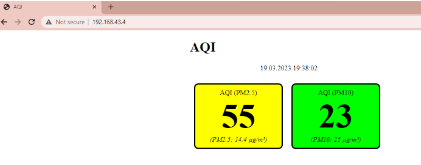
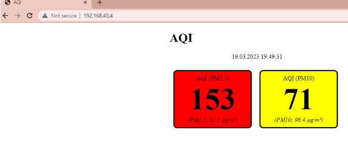

# Air Quality Sensor Automation

This project automates the monitoring of air quality using a Python script running on a small computer system. It collects and analyzes particulate matter (PM 2.5 and PM 10) data to help monitor air pollution levels in various environments such as homes, schools, and offices.

## Overview

The system captures real-time air quality data and displays it via a simple web interface accessible locally. The interface shows pollution levels with color-coded backgrounds indicating low, medium, and high air quality index (AQI) values.

## Setup and Usage

1. Prepare the system with the appropriate operating system installed on a microSD card (8-16GB recommended).
2. Install required Python packages:
    ```bash
    sudo apt install python3-pip -y
    pip3 install py-sds011
    ```
3. Connect the sensor to the system and verify recognition using system commands.
4. Use the provided Python script to communicate with the sensor and automate data collection. Configure the script to run on boot via crontab.
5. Access the air quality results through a local web page at the device’s IP address.

## Output Display

The web page visually represents pollution levels with:

- **Green background:** Low pollution
- **Yellow background:** Medium pollution
- **Red background:** High pollution

<<<<<<< HEAD
### Screenshots

Add your output screenshots below by placing images in the `images` folder and linking them here:

```markdown



=======
>>>>>>> b73399600485bf62ae886dc308d41cf074d86332
